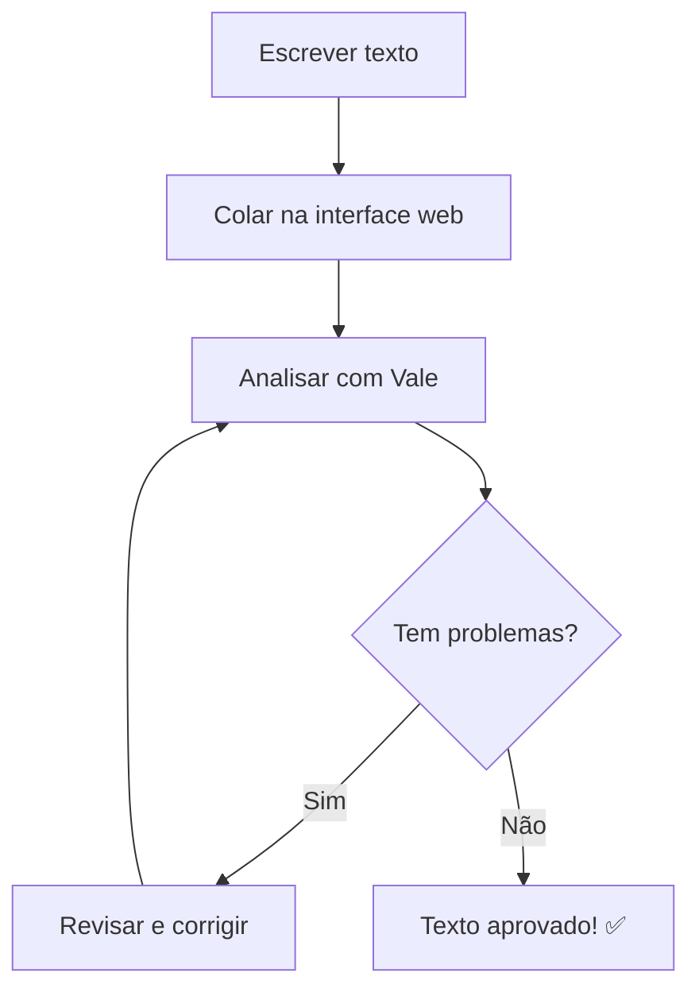
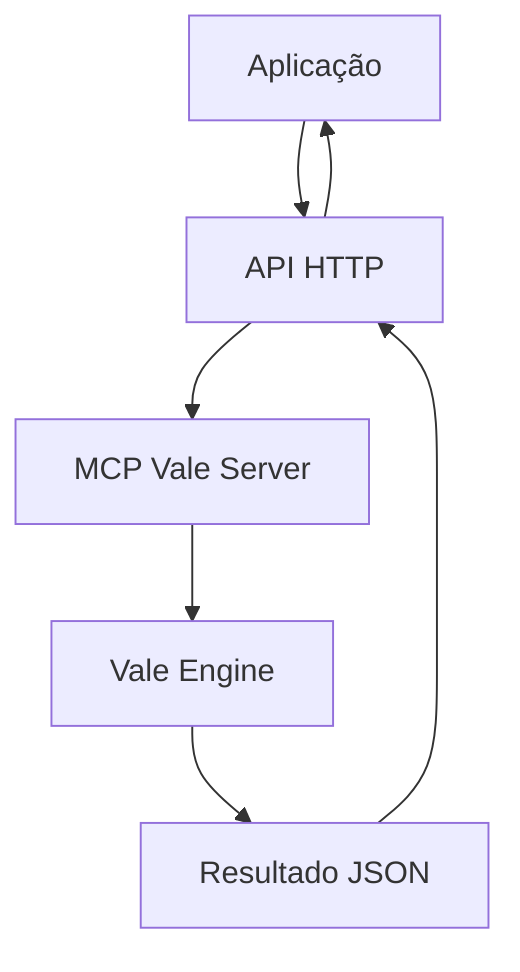
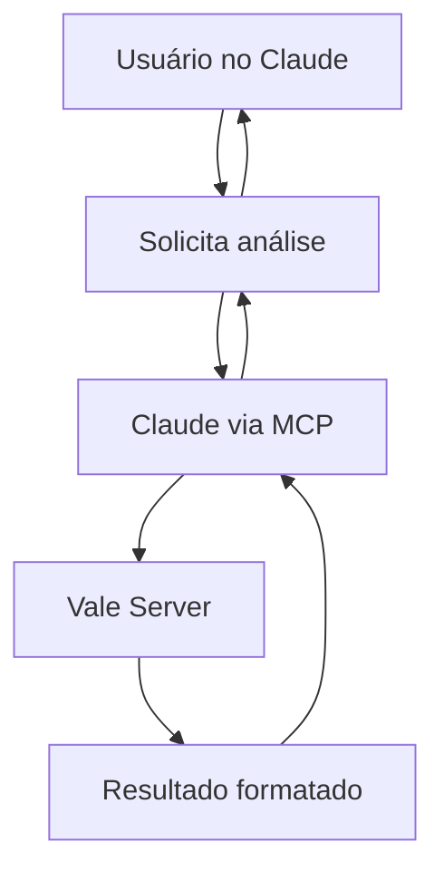

# 📚 Guias do MCP Vale Server

Bem-vindo à documentação completa do **MCP Vale Server**! Estes guias vão te ajudar a dominar todas as funcionalidades do servidor de verificação de texto.

## 🎯 Para Quem São Estes Guias

- **✍️ Escritores e Editores** - Melhore a qualidade dos seus textos
- **👩‍💻 Desenvolvedores** - Integre verificação de texto em suas aplicações
- **🤖 Usuários de IA** - Use assistentes IA com verificação de texto avançada
- **📝 Criadores de Conteúdo** - Garanta consistência e qualidade
- **🏢 Equipes** - Padronize estilo de escrita organizacional

## 🚀 Começando

### Para Iniciantes

Se você nunca usou o MCP Vale Server, comece aqui:

- **[🚀 Guia de Início Rápido](./getting-started.mdx)** - Configure tudo em minutos
  - Instalação completa
  - Primeiro teste
  - Verificação de funcionamento

### Escolha Sua Interface

Depois da instalação, escolha como quer usar:

- **[🌐 Interface Web](./web-interface.mdx)** - Interface gráfica simples
  - Ideal para uso ocasional
  - Copiar e colar textos
  - Resultados visuais imediatos

- **[🔌 API HTTP](./http-api.mdx)** - Integração programática
  - Para desenvolvedores
  - Automação de workflows
  - Integração com aplicações

- **[🤖 Protocolo MCP](./mcp-protocol.mdx)** - Assistentes IA
  - Claude Desktop
  - Integração direta com IA
  - Análise contextual

## 📖 Guias por Categoria

### 🎯 Uso Básico

| Guia | Descrição | Tempo | Dificuldade |
|------|-----------|-------|-------------|
| [Início Rápido](./getting-started.mdx) | Instalação e primeiro uso | 10 min | ⭐ |
| [Interface Web](./web-interface.mdx) | Usando a interface gráfica | 15 min | ⭐ |

### 🔧 Integração

| Guia | Descrição | Tempo | Dificuldade |
|------|-----------|-------|-------------|
| [API HTTP](./http-api.mdx) | Integração via REST API | 30 min | ⭐⭐ |
| [Protocolo MCP](./mcp-protocol.mdx) | Conectar com assistentes IA | 20 min | ⭐⭐ |

### ⚙️ Avançado

| Guia | Descrição | Tempo | Dificuldade |
|------|-----------|-------|-------------|
| [Configuração Avançada](./advanced-configuration.mdx) | Personalizar regras e estilos | 45 min | ⭐⭐⭐ |
| [Troubleshooting](./troubleshooting.mdx) | Resolver problemas comuns | 15 min | ⭐⭐ |

## 🎭 Casos de Uso

### Para Escritores

**Exemplo de fluxo:**
1. Escreve um artigo no seu editor favorito
2. Cola na [interface web](./web-interface.mdx)
3. Recebe sugestões de melhoria
4. Implementa as correções
5. Publica com confiança

### Para Desenvolvedores

**Exemplo de integração:**
1. Usuário submete texto via formulário
2. App chama [API HTTP](./http-api.mdx)
3. Recebe análise estruturada
4. Mostra sugestões na interface
5. Usuário corrige e resubmete

### Para Usuários de IA

**Exemplo de uso:**
1. Conversa normalmente com Claude Desktop
2. Pede para "analisar este texto com Vale"
3. Claude executa análise via [MCP](./mcp-protocol.mdx)
4. Recebe feedback detalhado
5. Implementa sugestões com ajuda da IA

## 🛠️ Conjuntos de Regras Disponíveis

O MCP Vale Server inclui múltiplos estilos de verificação:

### 📋 Regras Básicas
- **Vale** - Regras fundamentais de escrita
- **Aspect** - Verificação ortográfica

### 📚 Guias de Estilo
- **Google** - Google Style Guide
  - Clareza e concisão
  - Terminologia técnica
  - Formatação consistente

### ✨ Qualidade de Prosa
- **proselint** - Melhores práticas de escrita
  - Evita clichês e jargão
  - Detecta redundâncias
  - Sugere alternativas

### 🤝 Linguagem Inclusiva
- **alex** - Linguagem respeitosa e inclusiva
  - Detecta termos problemáticos
  - Sugere alternativas inclusivas
  - Promove comunicação respeitosa

### 🎯 Regras Personalizadas
- **WC-Styles** - Regras específicas do WriteChoice
  - Máximo 20 palavras por frase
  - Linguagem simples e direta
  - Evita palavras de preenchimento

## 📈 Progressão de Aprendizado

### Iniciante (Semana 1)
1. ✅ Complete o [Guia de Início Rápido](./getting-started.mdx)
2. ✅ Teste a [Interface Web](./web-interface.mdx)
3. ✅ Analise 5-10 textos diferentes
4. ✅ Entenda os tipos de problemas (erros, warnings, sugestões)

### Intermediário (Semana 2)
1. ✅ Configure [API HTTP](./http-api.mdx) se for desenvolvedor
2. ✅ OU configure [Protocolo MCP](./mcp-protocol.mdx) se usar IA
3. ✅ Experimente diferentes tipos de arquivo (.md, .txt, etc.)
4. ✅ Entenda como cada conjunto de regras funciona

### Avançado (Semana 3+)
1. ✅ Explore [Configuração Avançada](./advanced-configuration.mdx)
2. ✅ Crie regras personalizadas para seu contexto
3. ✅ Configure diferentes estilos por tipo de documento
4. ✅ Integre em workflows de produção

## 🆘 Precisa de Ajuda?

### Problemas Técnicos
- 🔍 [Troubleshooting](./troubleshooting.mdx) - Problemas comuns e soluções
- 🐛 [Issues no GitHub](https://github.com/writechoiceorg/mcp-writechoice-server/issues)

### Dúvidas e Discussão
- 💬 [GitHub Discussions](https://github.com/writechoiceorg/mcp-writechoice-server/discussions)
- 📚 [Documentação do Vale](https://vale.sh/docs/)

### Contribuições
- 🤝 [Como Contribuir](../CONTRIBUTING.md)
- 🔧 [Código Fonte](https://github.com/writechoiceorg/mcp-writechoice-server)

## 📋 Checklist de Domínio

Use este checklist para acompanhar seu progresso:

### Básico
- [ ] Vale instalado e funcionando
- [ ] Servidor compilado e executando
- [ ] Interface web acessível
- [ ] Primeiro texto analisado com sucesso

### Intermediário
- [ ] Integração funcional (API ou MCP)
- [ ] Compreende diferentes tipos de problemas
- [ ] Sabe interpretar resultados
- [ ] Usa em workflow regular

### Avançado
- [ ] Configuração personalizada
- [ ] Regras customizadas criadas
- [ ] Workflows automatizados
- [ ] Contribui para o projeto

## 🎉 Próximos Passos

Pronto para começar? Escolha seu caminho:

- 🚀 **Novo usuário**: [Guia de Início Rápido](./getting-started.mdx)
- 🌐 **Interface simples**: [Interface Web](./web-interface.mdx)
- 🔌 **Desenvolvedor**: [API HTTP](./http-api.mdx)
- 🤖 **Usuário de IA**: [Protocolo MCP](./mcp-protocol.mdx)

---

**Última atualização:** 24 de outubro de 2025  
**Versão dos guias:** 1.0.0