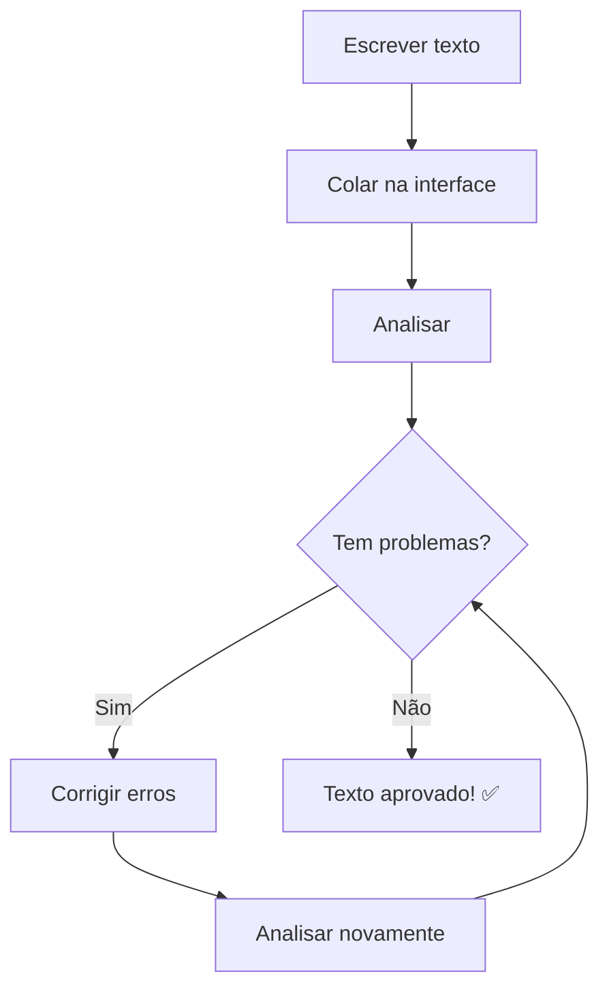

# 🌐 Guia da Interface Web

A interface web do MCP Vale Server oferece uma forma visual e intuitiva de verificar a qualidade do seu texto. Perfeita para usuários que preferem uma interface gráfica.

## Acessando a Interface Web

### 1. Inicie os Servidores

```bash
# Comando único (recomendado)
npm run start-npm

# Ou separadamente:
npm run http    # Servidor API (porta 3000)
npm run web     # Servidor Web (porta 8080)
```

### 2. Abra no Navegador

Acesse: `http://localhost:8080/web-interface.html`

## 📱 Tour pela Interface

### Layout Principal

A interface é dividida em seções claras:

```
┌─────────────────────────────────────┐
│           🚀 MCP Vale Server        │
├─────────────────────────────────────┤
│  📝 Área de Texto                   │
│  ┌─────────────────────────────────┐ │
│  │ Digite seu texto aqui...        │ │
│  │                                 │ │
│  └─────────────────────────────────┘ │
│                                     │
│  📄 Nome do Arquivo: [document.md]  │
│                                     │
│  [🔍 Analisar Texto] [🔄 Limpar]    │
├─────────────────────────────────────┤
│  📊 Resultados da Análise           │
│  (aparece após a análise)           │
└─────────────────────────────────────┘
```

### Funcionalidades Principais

#### 1. **Área de Texto**
- Campo de texto multilinha
- Suporte a Markdown
- Redimensionável
- Contagem automática de caracteres

#### 2. **Campo Nome do Arquivo**
- Define o contexto para análise
- Padrão: `document.md`
- Influencia algumas regras do Vale

#### 3. **Botões de Ação**
- **🔍 Analisar Texto**: Executa a verificação
- **🔄 Limpar**: Limpa texto e resultados
- **📋 Copiar Resultado**: Copia análise para clipboard

## 🎯 Como Usar

### Análise Básica

1. **Digite ou cole seu texto** na área principal
2. **Opcional:** Altere o nome do arquivo se necessário
3. **Clique em "Analisar Texto"**
4. **Aguarde os resultados** (geralmente < 2 segundos)

### Exemplo Prático

Vamos analisar um texto com problemas intencionais:

```
Their are many problems in this sentance and its 
way to long for good readability and understanding 
by readers who might struggle with complex sentences 
that go on and on without proper punctuation or breaks.
```

**Resultado esperado:**
```
Vale Lint Results for document.md
Total Issues: 5

🚨 ERRORS (2):
  Line 1: 'Their' is incorrect. Use 'There' instead.
  Line 1: 'sentance' is incorrect. Use 'sentence' instead.

⚠️ WARNINGS (2):
  Line 1: Consider removing 'way'.
  Line 4: Consider shorter sentences for better readability.

💡 SUGGESTIONS (1):
  Line 1: Try to keep sentences under 20 words.
```

## 📊 Interpretando os Resultados

### Tipos de Problemas

import { Alert, AlertDescription } from '@/components/ui/alert'

<Alert variant="destructive">
  <AlertDescription>
    **🚨 ERRORS** - Problemas que devem ser corrigidos (ortografia, gramática básica)
  </AlertDescription>
</Alert>

<Alert variant="warning">
  <AlertDescription>
    **⚠️ WARNINGS** - Sugestões importantes de estilo e clareza
  </AlertDescription>
</Alert>

<Alert variant="info">
  <AlertDescription>
    **💡 SUGGESTIONS** - Melhorias opcionais para qualidade do texto
  </AlertDescription>
</Alert>

### Informações de Cada Problema

Cada problema inclui:
- **📍 Localização**: Linha onde foi encontrado
- **📝 Descrição**: O que está errado e como corrigir
- **🔧 Regra**: Qual conjunto de regras detectou o problema

### Exemplo de Problema Detalhado

```
Line 1: 'Their' is incorrect. Use 'There' instead. (Aspect.Spelling)
```

- **Line 1**: Localização do problema
- **'Their' is incorrect**: Descrição do erro
- **Use 'There' instead**: Sugestão de correção
- **(Aspect.Spelling)**: Regra que detectou (verificação ortográfica)

## 🎨 Funcionalidades Avançadas

### Tipos de Arquivo Suportados

A interface detecta automaticamente o tipo de conteúdo baseado na extensão:

- **`.md`** - Markdown (padrão)
- **`.txt`** - Texto simples
- **`.rst`** - reStructuredText
- **`.adoc`** - AsciiDoc

### Atalhos de Teclado

- **Ctrl/Cmd + Enter**: Analisar texto
- **Ctrl/Cmd + L**: Limpar tudo
- **Ctrl/Cmd + C**: Copiar resultado (quando focado)

### Configurações de Exibição

A interface se adapta automaticamente:
- **Tema**: Segue preferência do sistema (claro/escuro)
- **Responsivo**: Funciona em dispositivos móveis
- **Acessibilidade**: Suporte a leitores de tela

## 💡 Dicas de Uso

### Para Melhores Resultados

1. **Use nomes de arquivo apropriados**
   ```
   ✅ article.md, blog-post.md, documentation.rst
   ❌ test.txt, untitled.md
   ```

2. **Analise seções menores**
   - Textos até 1000 palavras têm análise mais rápida
   - Quebre documentos longos em seções

3. **Revise por tipo de problema**
   - Corrija ERRORs primeiro
   - Considere WARNINGs importantes
   - Avalie SUGGESTIONs opcionalmente

### Fluxo de Trabalho Recomendado



## 🔧 Solução de Problemas

### Interface não carrega

1. **Verifique se o servidor web está rodando**
   ```bash
   npm run web
   ```

2. **Confirme a URL**
   - Deve ser: `http://localhost:8080/web-interface.html`
   - Não: `http://localhost:8080/` (sem o arquivo)

### Análise não funciona

1. **Verifique se a API está rodando**
   ```bash
   curl http://localhost:3000/test
   ```

2. **Teste o Vale diretamente**
   ```bash
   vale --version
   ```

3. **Veja erros no console do navegador**
   - F12 → Console → procure por erros em vermelho

### Resultados estranhos

1. **Verifique o nome do arquivo**
   - Alguns tipos têm regras diferentes

2. **Teste com texto simples**
   ```
   This is a simple test sentence.
   ```

3. **Reinicie os servidores**
   ```bash
   # Para os servidores (Ctrl+C) e reinicie
   npm run start-npm
   ```