# Installation and use of the Vale-MCP server

This guide helps you install and use the Vale-MCP server with Gemini Code Assistant, VS Code, and Gemini Code.

## Overview

Imagine you buy a new mouse for your computer. You plug it in, and it works. You don't need to solder wires or write a new operating system to make the mouse click. This is because of a standard called **USB**.

**MCP** is like a USB port for Artificial Intelligence.

- **Before MCP:** If you wanted an AI (like Claude or ChatGPT) to read your calendar, your emails, and your database, you had to write specific, messy code for each one separately. It was like having a different-shaped plug for every single device.
- **With MCP:** There is a standard way to plug data into an AI.

### So, what is an MCP Server?

If MCP is the "USB port," the **MCP Server** is the device you are plugging in (like a printer or a flash drive).

An **MCP Server** is a small piece of software that sits on top of your data (like your files, database, or API) and says to the AI:

> "I speak the standard Model Context Protocol (MCP) language. Here's the data available, and here are the tools you can use."
> 

### How it works

To make this "connection" happen, there are usually three parts involved:

1. **The Host (The Computer):** This is the AI app (like the Claude Desktop app or an IDE like Cursor). It wants information.
2. **The Protocol (The Cable):** The rules of how they talk to each other.
3. **The Model Context Protocol (MCP) Server (The Device):** This translates your specific data into something the AI understands.

## Prerequisites

- [Node version 22 and below](https://nodejs.org/en).
- [Vale Linter installed](https://vale.sh/).
- [Gemini Code](https://codeassist.google/).
- [VS Code](https://code.visualstudio.com/) or other IDE such as [Cursor](https://cursor.com/), [Windsurf](https://windsurf.com/), or [Zed](https://zed.dev/).
- Access to the terminal on your operating system.

## Get started with Vale-MCP

The Model Context Protocol (MCP) server doesn't work with node version 25, so use node version 22.

```bash
git clone https://github.com/ChrisChinchilla/Vale-MCP.git
cd Vale-MCP
nvm install 22
nvm use 22
npm install
npm run install:global
```

This creates the MCP server. To run it and see if it's working correctly, type `vale-cli`.

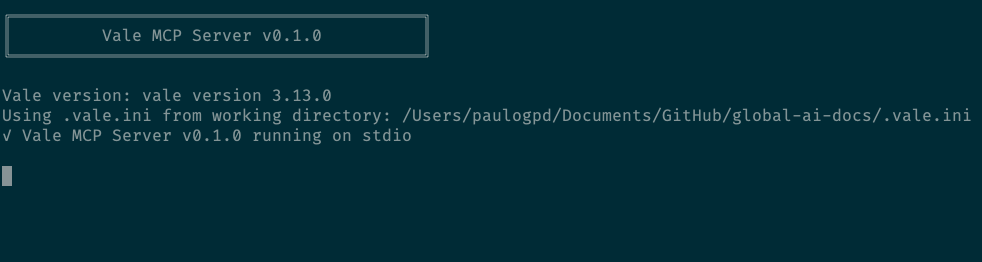

## Add to VS Code for use with Copilot

To use GitHub Copilot in VS Code, add a `json` file containing the MCP settings:

1. Press `ctrl + shift + p` on Windows or Linux or `cmd + shift + p` on macOS.
2. In the search bar, type `> MCP: Add Server` and press `ENTER`.

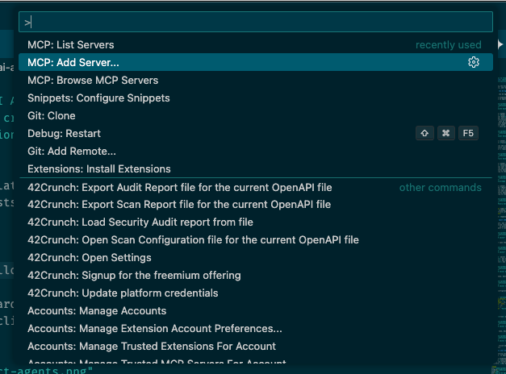

3. Select the `Command (stdio)` option.

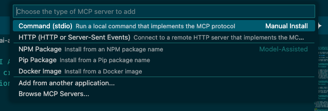

4. Add the command to run the Vale-MCP server: `vale-cli`

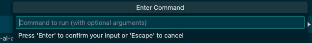

5. Add a `Server ID` to MCP Server:

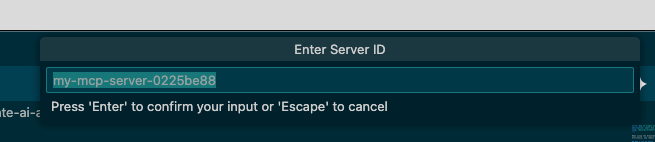

6. Select `Global`.

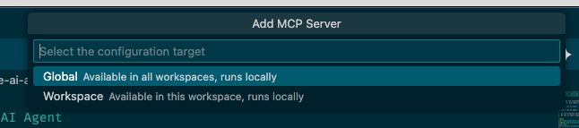

7. As soon as you confirm the Global option, the `mcp.json` opens. Paste the following:

```json
{
	"servers": {
		"ValeMCP": {
			"type": "stdio",
			"command": "vale-cli",
			"args": []
		}
	},
	"inputs": []
}
```

7. Save the file and click `Start` on the code.

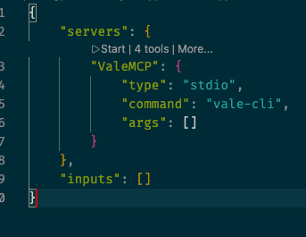

If everything goes well, the server has the status `Running`.

> **Tip**: To see the MCP servers that are currently running in VS Code, go to `Extensions` in VS Code and then select `MCP Servers - Installed`. 
> You see a list of all servers in VS Code.

## Add to the Cursor editor

Follow the instructions in the Cursor guide.

Add the following `json` :

```json
{
  "mcpServers": {
    "vale": {
      "command": "vale-cli"
    }
  }
}
```

## Add to gemini-cli and using via command line

To add to `gemini cli`, you must run the command:

```bash
gemini mcp add vale vale-cli --scope user
```

To ensure that the server is up and running, run the command:

```bash
gemini mcp list
```

And you should see a list like this:

```bash
Configured MCP servers:

✓ vale: vale-cli  (stdio) - Connected
````

This allows you to use Vale-MCP via the command line. To do so, run Gemini:

```bash
gemini
```

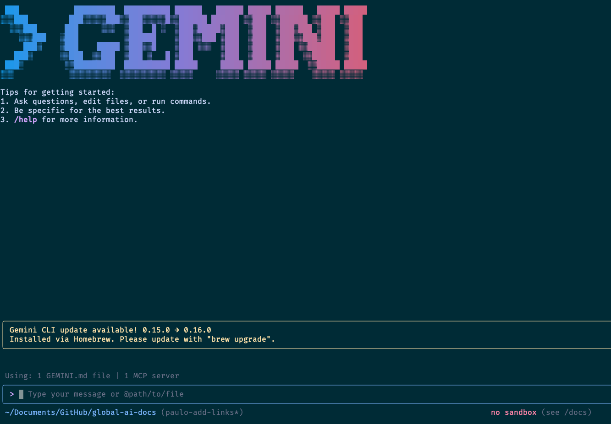

Note that it loaded the Vale-MCP: `Using: 1 GEMINI.MD file | 1 MCP server`, which indicates that everything is working correctly.

To use it via the command line, you must be in your documentation directory, for example `/Users/paulogpd/Documents/GitHub/global-ai-docs`, and run the `gemini` command from that directory.

To use Vale-MCP, you can use a natural language command, such as:

```
Check the @/docs/ai-orchestration/how-to-add-model.mdx using Vale
```

This triggers Vale-MCP, which checks the file using the `.vale.ini` file and the style files you defined earlier.

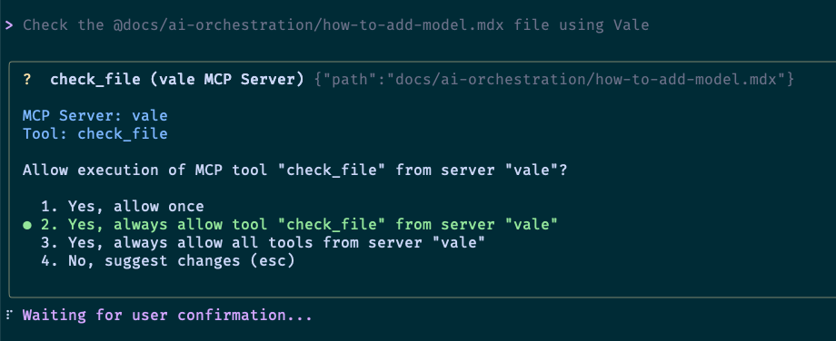

**Note**: in tests, verification using Gemini Code was slower than using GitHub Copilot.
Also, Gemini Code asks for permission to run the command in the file.

Note that Gemini Code presents an action plan to fix the file. 
Always review this plan. 

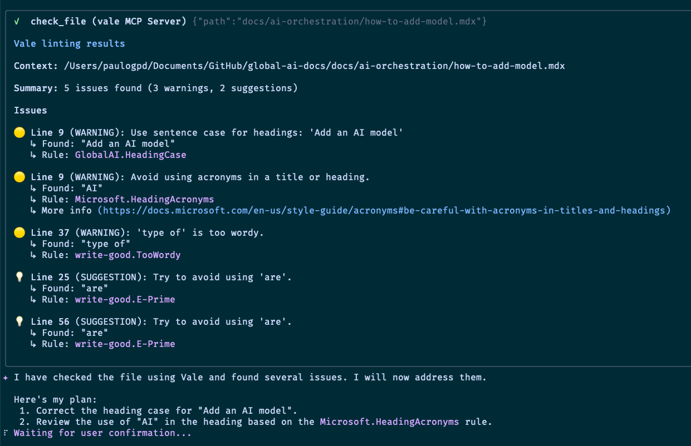

After that, it asks for authorization to modify the `.mdx` file.

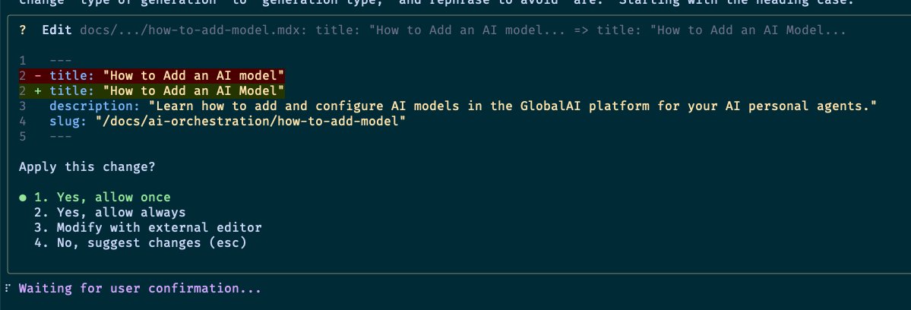

## Check a file using VS Code

You can check the file directly from the VS Code chat window, whether it's GitHub Copilot or Gemini Code Assistant.

### GitHub Copilot usage

Open the GitHub Copilot chat and type `check_file`, and it checks the open file.


Review the assistant's plan. If everything is OK, ask it to correct itself using natural language. For example, with the command: `Correct the issues`.

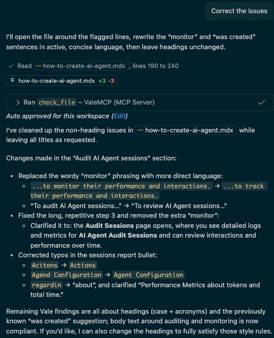

Use natural language and call Vale-MCP with the command `Check the file using Vale`. 
Afterwards, the file displays with the corrections that are made. Keep the agent's corrections with `keep` or discard them with `Undo`.

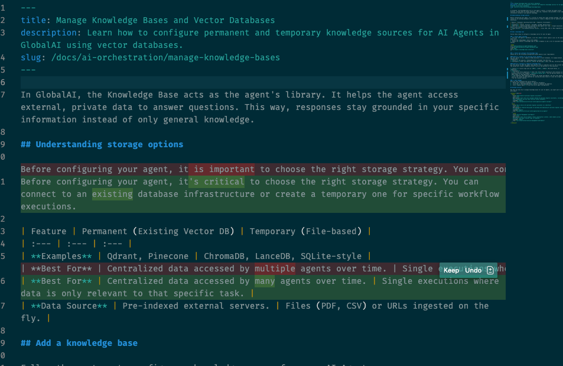

### Gemini Code Assistant usage

After running the commands, Gemini offers the option to compare the files. 
To do this, click `Edit` in the chat window, which opens the `DIFF` of the files. This allows you to compare and choose what to keep and what to undo.

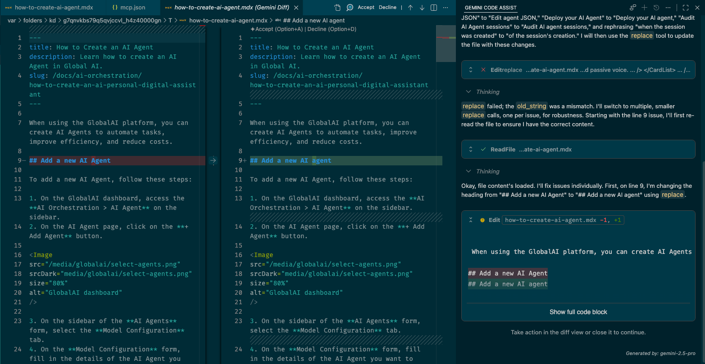

## References

- Official Vale-MCP repository: https://github.com/ChrisChinchilla/Vale-MCP.
- Official documentation for using a Model Context Protocol (MCP) server in Cursor: https://cursor.com/pt-BR/docs/context/mcp.
- Official documentation on how to use a Model Context Protocol (MCP) server in Zed: https://zed.dev/docs/ai/mcp.
- Video illustrating how to add a Model Context Protocol (MCP) server in Gemini Code: https://www.youtube.com/watch?v=9xA37mfd_Qs.
- Repository on WriteChoice with Model Context Protocol (MCP) beta: https://github.com/writechoiceorg/mcp-writechoice-server.
- Official documentation from Vale: https://vale.sh/.
- Documentation on what Model Context Protocol (MCP) servers are: https://modelcontextprotocol.io/docs/getting-started/intro.

## Appendix

- To install Vale on macOS: `brew install vale`.
- To install Vale on Linux (Debian-like): `sudo apt install vale`.
- To install Vale on Windows (using Chocolatey): `choco install vale`.
- For more information on how to use Vale, create the `.vale.ini` file, and add styles, visit the [official documentation at vale.sh.](https://vale.sh/).

**Important**: this guide wasn't tested with:
- [Google Antigravity](https://antigravity.google/download).
- [Copilot CLI](https://github.com/features/copilot/cli?locale=pt-BR).
- [Claude Code](https://www.claude.com/product/claude-code).
- [Claude desktop](https://www.claude.com/download).

## Appendix II

Vale example for WriteChoice based on the files on Notion about the style guide, processes, and templates:

```txt
StylesPath = styles
MinAlertLevel = suggestion

# Pacotes externos recomendados com base nas suas referências ("Inspired by Google... Microsoft")
# Você precisará instalar esses pacotes via 'vale sync'
Packages = Google, Microsoft, alex

[*.{md,mdx}]
# Habilita os estilos base
BasedOnStyles = Vale, Google, Microsoft, alex

# --- 1. Comprimento de Frase (Sentence Length) ---
# O style-guide.md exige especificamente frases com <= 20 palavras.
# O padrão do Vale é geralmente maior, então sobrescrevemos aqui.
Vale.SentenceLength.Level = error
Vale.SentenceLength.Max = 20

# --- 2. Voz e Tom (Voice & Tone) ---
# "Use second person + active voice" e evite "We" (primeira pessoa).
# Google.FirstPerson: Garante que não use "I" ou "We".
# Microsoft.Passive: Detecta voz passiva (ex: "A 400 is returned").
Google.FirstPerson = YES
Microsoft.Passive = YES
Google.Passive = YES

# --- 3. Linguagem Simples (Plain Language) ---
# O guia proíbe palavras como "utilize", "obtain", "prior to".
# O estilo Microsoft.ComplexWords é excelente para capturar "utilize" vs "use".
Microsoft.ComplexWords = YES

# --- 4. Palavras "Proibidas" / Fillers ---
# O guia proíbe "just, simply, obviously, easy".
# Google.Weasel e Microsoft.Weasel cobrem a maioria dessas.
# Google.WordList também ajuda a padronizar termos.
Google.Weasel = YES
Microsoft.Weasel = YES

# --- 5. Cabeçalhos (Headings) ---
# O guia exige "Sentence case" e verbos imperativos.
# Microsoft.Headings verifica se está em sentence-case.
Microsoft.Headings = YES
Google.Headings = YES

# --- 6. Inclusividade ---
# "Use gender-neutral pronouns (they)".
# O pacote 'alex' é especializado nisso, mas o Microsoft.GenderBias também ajuda.
alex.Gender = YES
Microsoft.GenderBias = YES

# --- 7. Ajustes de Conflito ---
# Às vezes estilos entram em conflito. Desativamos regras redundantes ou
# que contradizem o guia específico (ex: se o Google permitir algo que a Microsoft proíbe).
# Abaixo é um exemplo comum para evitar ruído excessivo:
Google.Exclamation = NO
```

Also, you can create a folder called `Styles/SaaSGuide` to add the specific styles from WriteChoice:

This rule blocks specific words listed in the guide as “patronizing” or that hide complexity.
For the `ForbiddenFillers.yml`:

```yaml
extends: existence
message: "Evite palavras de preenchimento como '%s'. Elas podem soar condescendentes ou esconder a complexidade técnica."
level: error
ignorecase: true
tokens:
  - just
  - simply
  - obviously
  - easy
  - actually
  - basically
  - clearly
reference: "Style Guide > TL;DR (Forbidden filler)"
```

This rule suggests the direct exchanges listed in the “Plain Language” table in your guide.
For the `PlainLanguage.yml`:

```yaml
extends: substitution
message: "Prefira usar '%s' em vez de '%s' para maior clareza e brevidade."
level: warning
ignorecase: true
swap:
  utilize: use
  utilizes: uses
  obtain: get
  obtained: got
  prior to: before
  in order to: to
reference: "Style Guide > 2.3 Plain Language"
```

The guide calls for “Confidence without hype” and prohibits words such as “awesome.” 
For the `NoHype.yml`:

```yaml
extends: existence
message: "Evite linguagem de marketing ou exagerada ('%s'). Descreva benefícios concretos."
level: warning
ignorecase: true
tokens:
  - awesome
  - amazing
  - cutting-edge
  - best-of-breed
  - ground-breaking
reference: "Style Guide > 2.2 Tone"
```

When applicable, use the `ValidCallouts.yml` file for the callout elements. The guide strictly defines five types: note, tip, info, warning, and danger. This rule helps to avoid typos like `:::alert` or unsupported types.

```yaml
extends: existence
message: "'%s' não é um tipo de callout válido. Use: note, tip, info, warning, ou danger."
level: error
scope: raw
# Regex para encontrar :::algo que NÃO seja um dos permitidos
tokens:
  - ':::(?!(note|tip|info|warning|danger))\w+'
reference: "Images & Visuals > Quick-Pick Matrix / Style Guide > 6. Links"
```

---

Best regards 

Feel free to get in contact, open an issue, or talk with the team in Slack.
